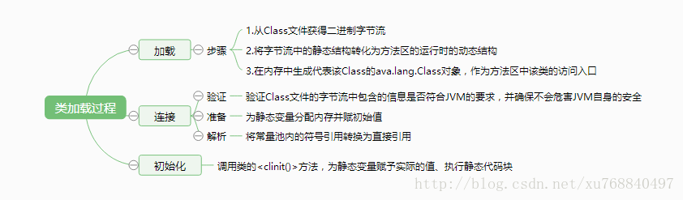
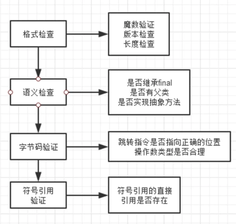
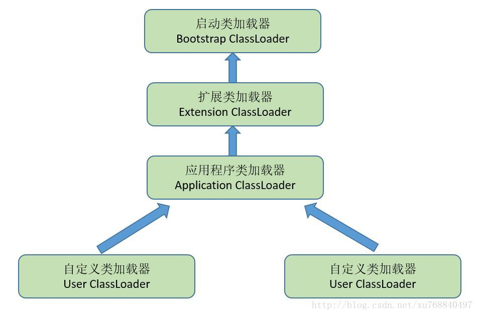

### jvm 类加载过程

1. 加载：查找字节流，并创建类
- 通过“类全名”获取定义此类的二进制字节流，存储在运行时内存区的方法区
- 将其转换为一个与目标类型对应的java.lang.Class对象实例，作为方法区该类各种数据的访问入口
2. 链接：将加载到jvm中的二进制字节流的类数据信息合并到jvm的运行时状态，经由验证、准备和解析三阶段
- 验证：验证类数据信息是否符合JVM规范，是否是一个有效的字节码文件，验证内容涵盖了类数据信息的格式验证、语义分析、操作验证等。

- 准备：仅仅为类变量(即static修饰的字段变量)分配内存并且设置该类变量的初始值即零值，这里不包含用final修饰的static，因为final在编译的时候就会分配了，同时这里也不会为实例变量分配初始化。类变量会分配在方法区中，而实例变量是会随着对象一起分配到Java堆中。

- 解析：解析主要就是将常量池中的符号引用替换为直接引用的过程。符号引用就是一组符号来描述目标，可以是任何字面量，而直接引用就是直接指向目标的指针、相对偏移量或一个间接定位到目标的句柄。

3. 初始化：调用\<clinit\>方法(为静态变量赋实际值，执行静态代码块), 但直接赋值的final static字段，并且类型是基本类型或字符串，会被javac标记成ConstantValue，其初始化由jvm直接完成

- jvm会通过加锁保证类的clinit只执行一次

### 类加载器

#### jvm 角度
1. 启动类加载器（Bootstrap ClassLoader）：C++实现，是jvm一部分
2. 其他的类加载器，java实现，独立于虚拟机外部，继承于java.lang.ClassLoader

#### developer 角度
1. 启动类加载器（Bootstrap ClassLoader）：无法获取引用，不允许直接引用操作，加载Java_Home/lib下的类库到内存
2. 标准扩展类加载器（Extension ClassLoader）： 负责将Java_Home /lib/ext或者由系统变量 java.ext.dir指定位置中的类库加载到内存中
3. 应用程序类加载器（Application ClassLoader）：负责将系统类路径（CLASSPATH）中指定的类库加载到内存中，这个类加载器是ClassLoader中的getSystemClassLoader()方法的返回值，一般称为系统（System）加载器。

### 双亲委派模型
某个特定的类加载器在接到加载类的请求时，首先将加载任务委托给父类加载器，依次递归，如果父类加载器可以完成类加载任务，就成功返回；只有父类加载器无法完成此加载任务时，才自己去加载。

使用双亲委托机制的好处是：能够有效确保一个类的全局唯一性，当程序中出现多个限定名相同的类时，类加载器在执行加载时，始终只会加载其中的某一个类。